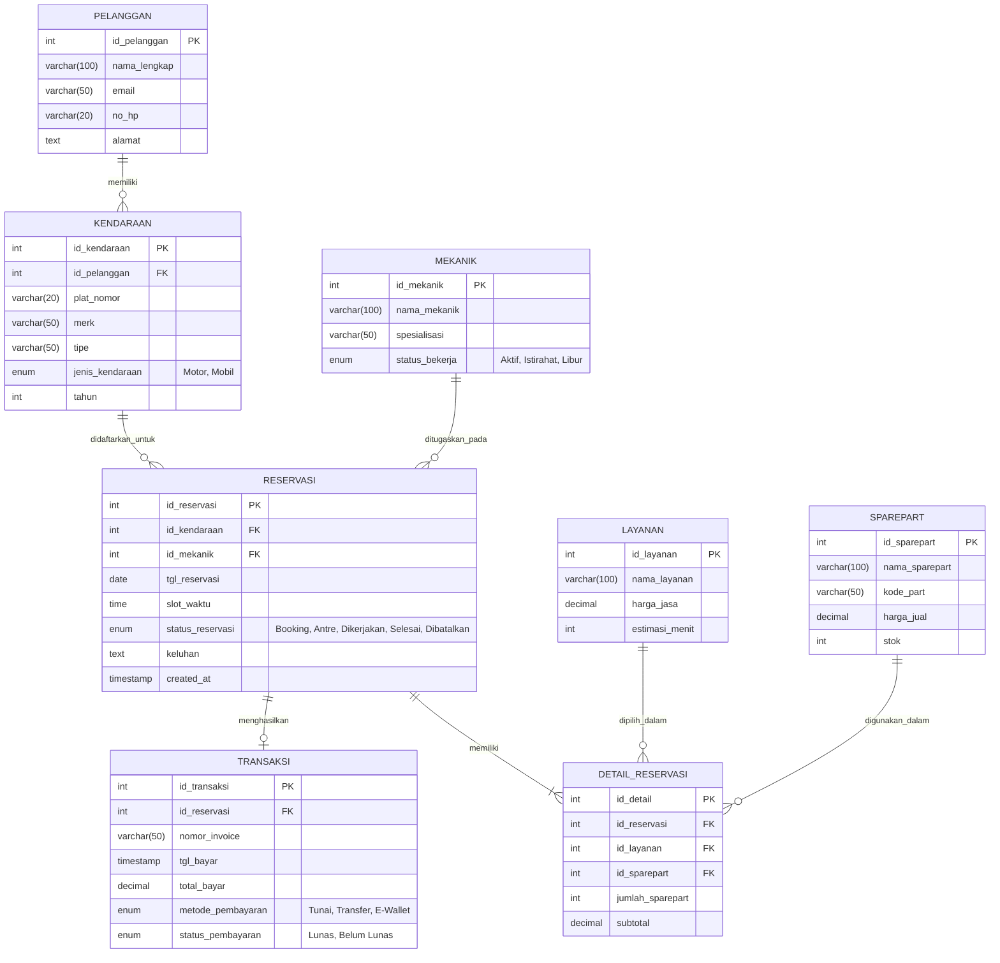

# Aplikasi Reservasi Layanan Bengkel (ReservasiBengkel)

[](#)
[](#)
[](LICENSE)

ReservasiBengkel adalah platform manajemen operasional dan reservasi layanan bengkel kendaraan (motor/mobil) berbasis digital. Sistem ini dirancang untuk memangkas waktu tunggu antrean pelanggan secara signifikan, memberikan transparansi estimasi biaya servis, serta mempermudah pemilik bengkel dalam mengelola jadwal mekanik dan inventaris suku cadang (spare part).

Sistem ini umumnya diimplementasikan dalam dua subsistem utama:
1.  **Aplikasi Client (Mobile/Web)**: Digunakan oleh pelanggan untuk mendaftarkan kendaraan, menjadwalkan reservasi, memilih jenis servis, dan memantau status pengerjaan secara real-time.
2.  **Dashboard Admin & Kasir (Web)**: Digunakan oleh administrator, mekanik, dan pemilik bengkel untuk mengelola antrean masuk, menetapkan mekanik, mencatat penggunaan spare part, serta mengelola pembukuan transaksi keuangan.

---

## 🌟 Fitur Utama

Sistem ini memfasilitasi kebutuhan empat pengguna utama (Aktor):

### 1. Pelanggan (Customer)
*   **Registrasi Kendaraan**: Menyimpan data spesifikasi kendaraan pelanggan (nomor polisi, merk, tipe, transmisi, tahun pembuatan).
*   **Booking Servis Online**: Memilih jadwal tanggal dan slot waktu kosong yang tersedia secara real-time.
*   **Katalog Servis & Suku Cadang**: Memilih jenis perawatan (servis rutin, ganti oli, servis kelistrikan, dll.) dan melihat daftar estimasi harga suku cadang asli.
*   **Pelacakan Antrean (Live Status Tracking)**: Memantau status pengerjaan kendaraan dari jarak jauh (*Antre*, *Sedang Dikerjakan*, *Uji Coba*, hingga *Selesai*).
*   **Riwayat Servis (Digital Service Record)**: Menyimpan catatan rekam medis kendaraan berupa riwayat perbaikan sebelumnya untuk referensi servis berikutnya.

### 2. Administrator & Kasir
*   **Verifikasi Jadwal Reservasi**: Menyetujui atau melakukan reschedule terhadap permohonan reservasi yang masuk.
*   **Alokasi Mekanik & Work Order**: Menugaskan mekanik yang kompeten dan sedang *available* untuk menangani kendaraan tertentu.
*   **Manajemen Invoice & Pembayaran**: Membuat tagihan otomatis berdasarkan layanan yang diselesaikan serta suku cadang yang digunakan, kemudian memproses pembayaran (tunai atau e-wallet).

### 3. Mekanik (Technician)
*   **Daftar Tugas (Job Sheet)**: Melihat daftar kendaraan yang ditugaskan kepada mereka beserta catatan keluhan pelanggan.
*   **Update Progress**: Mengubah status pengerjaan kendaraan langsung dari sistem agar pelanggan mendapatkan notifikasi real-time.
*   **Rekomendasi Spare Part**: Mencatat suku cadang tambahan yang perlu diganti setelah melakukan inspeksi kendaraan.

### 4. Pemilik Bengkel (Owner / Kepala Bengkel)
*   **Laporan Keuangan**: Laporan laba-rugi harian, mingguan, dan bulanan dari biaya jasa servis dan penjualan suku cadang.
*   **Analisis Produktivitas Mekanik**: Mengukur performa mekanik berdasarkan jumlah kendaraan yang berhasil diselesaikan secara tepat waktu.
*   **Monitoring Stok Suku Cadang**: Memberikan peringatan dini (alert) ketika stok spare part tertentu mulai menipis di gudang.

---

## 🛠️ Pilihan Teknologi (Tech Stack)

Aplikasi ini dapat dibangun dengan arsitektur modern berikut:

### 📱 Skenario A: Mobile App (Pelanggan) + Web API (Backend)
*   **Client App (Mobile)**: Flutter (Dart) atau React Native (JavaScript/TypeScript).
*   **Backend API & Admin Panel**: Laravel (PHP) / CodeIgniter 4 (PHP) / Node.js (Express).
*   **Database**: MySQL atau PostgreSQL.

### 💻 Skenario B: Responsive Web App (Monolitik)
*   **Framework**: Laravel + TailwindCSS (atau CodeIgniter 4 + Bootstrap).
*   **Frontend Interactivity**: Livewire, Vue.js, atau React.js.
*   **Database**: MySQL.

---

## 🗄️ Rancangan Database (Entity Relationship Diagram)

Diagram berikut menunjukkan hubungan tabel utama dalam mendukung alur reservasi, alokasi mekanik, hingga transaksi pembayaran:



---

## 🚀 Panduan Memulai Pengembangan (Lokal)

### Langkah Awal (Menggunakan Laravel & MySQL)

1.  **Clone Repository**:
    ```bash
    git clone https://github.com/KrisArdani/ReservasiBengkel.git
    cd ReservasiBengkel
    ```

2.  **Instalasi Dependensi**:
    *   Jika backend menggunakan Laravel:
        ```bash
        composer install
        npm install && npm run dev
        ```
    *   If client menggunakan Flutter:
        ```bash
        flutter pub get
        ```

3.  **Konfigurasi Environment**:
    Duplikat file `.env.example` menjadi `.env` lalu sesuaikan kredensial database Anda:
    ```env
    DB_CONNECTION=mysql
    DB_HOST=127.0.0.1
    DB_PORT=3306
    DB_DATABASE=reservasi_bengkel
    DB_USERNAME=root
    DB_PASSWORD=
    ```

4.  **Migrasi & Seed Database**:
    Jalankan perintah migrasi tabel database beserta data seeder awal:
    ```bash
    php artisan migrate --seed
    ```

5.  **Jalankan Server Lokal**:
    ```bash
    php artisan serve
    ```
    Buka `http://127.0.0.1:8000` di browser untuk mengakses aplikasi.

---

## 📄 Lisensi
Proyek ini dilindungi di bawah lisensi MIT. Lihat file `LICENSE` untuk detail lebih lanjut.
